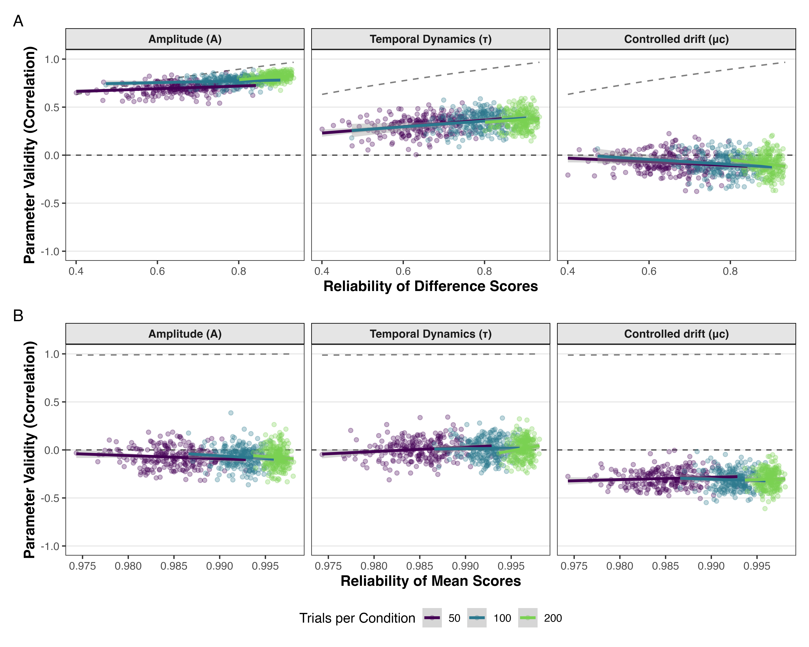

```{r knitr-options, include = FALSE}
knitr::opts_chunk$set(
  eval = TRUE,
  echo = FALSE,
  output = TRUE,
  warning = FALSE,
  error = FALSE,
  message = FALSE,
  collapse = TRUE
)
```

```{r}
# use relative paths to load & save data
pacman::p_load(here, SimDesign, tidytable, data.table, ggplot2, ComputationalValidity)
# source(here("scripts","LoadResultsFiles.R"))
```

## Introduction

The present work is concerned with a problem that cuts across cognitive psychology: psychometric methods alone cannot determine what cognitive tasks actually measure, and decades of methodological refinement have not resolved it.

In attention control research, conflict tasks that produce robust experimental effects often fail to correlate substantially across individuals -- the so-called reliability paradox [@HedgeEtAl2018; @ReyMermetEtAl2018; @EnkaviEtAl2019]. Some researchers responded by optimizing reliability, sampling diverse conflict tasks, and demonstrating coherent factor structures [@DraheimEtAl2021; @Burgoyne2023], or by using drift-diffusion model parameters instead of behavioral scores [@Yanguez2024]. Others argued that these tasks do not tap the same processes, that the new measures face challenges similar to those of the original ones [@ReyMermet2025], and that attention control factors relate more strongly to processing speed than to working memory capacity [@LoefflerEtAl2024; @OberauerEtAl2024].

A similar pattern characterizes working memory research. Complex span and N-back tasks correlate only moderately despite adequate reliability, a pattern first documented by @KaneEtAl2007 and confirmed meta-analytically by @RedickLindsey2013. The resulting debate spans nearly two decades: some researchers argue that the tasks measure distinct constructs [@KaneEtAl2007; @BurgoyneEtAl2024WM], whereas others maintain that working memory capacity is a unified ability complicated by task-specific demands [@SchmiedekEtAl2009; @WilhelmEtAl2013; @SchmiedekEtAl2014; @WilhelmEtAl2025].

The processing speed literature tells a complementary story. Early attempts to isolate process-specific speed using elementary cognitive tasks such as memory-scanning [@Sternberg1966] or the Hick paradigm [@Hick1952] failed to produce robust correlations with intelligence [@BeauducelBrocke1993]. @Lohman1994 explained why: most between-person variance is carried by the intercept of regression models, which reflects what is common across conditions, not by slopes or experimental contrasts. More recent diffusion-model decompositions confirm the problem from a different angle: drift rate, non-decision time, and other parameters relate differently to intelligence [@SchubertEtAl2015; @LercheEtAl2020; @SchubertEtAl2022], and different distributional parameters of reaction time show distinct developmental trajectories [@SchmitzWilhelm2016]. Traditional measures of "processing speed" thus conflate perceptual encoding, decision processes, and motor execution.

Across these domains, the same structural limitation recurs. High reliability and well-converging factor models do not guarantee valid measurement of the intended constructs. Factor coherence demonstrates shared variance but not what mechanisms produce it. Correlation patterns cannot adjudicate whether weak convergent validity reflects measurement inadequacy or genuine construct distinctiveness. Many researchers treat these difficulties as methodological problems requiring better techniques, larger samples, or more careful task selection. We argue that the core problem is theoretical. Without explicit commitments about how cognitive processes generate observable behavior, validation becomes circular: tasks are validated by their correlations with other tasks assumed to measure the same construct.

We develop this argument by building on @Borsboom2004's causal conception of validity, according to which valid measurement requires attributes to *causally produce* measurement outcomes. Computational cognitive models implement this framework: they specify what cognitive processes exist (as model parameters) and how these processes generate observations (through explicit generative mechanisms). Parameter recovery analysis then tests the causal link, that is, whether individual differences in behavioral indicators reflect individual differences in the generating processes.

In the following, we first diagnose why traditional validation approaches cannot resolve what tasks measure, then develop a framework for model-based validity analysis, and finally demonstrate this framework through systematic simulations of conflict task performance. The simulations reveal parameter confounding across indicators, reliability-validity dissociations, and correlation transfer failures from parameters to behavioral measures. We conclude with implications for measurement practice and concerns about model dependence. Although our demonstrations focus on conflict tasks, the principles apply wherever cognitive processes must be inferred from behavioral observations.

## Classical Validity Theory

Theory has been central to validity frameworks since their inception, but the specific theoretical requirements for cognitive task validation have often remained implicit in practice.

@CronbachMeehl1955 introduced the concept of construct validity for situations where the measured attribute is not directly observable. They argued that validation is fundamentally theory testing: the construct is embedded in a "nomological network" that generates testable predictions about patterns among measures, experimental manipulations, and group differences. Critically, they recognized the risk of circularity: "Unless the network makes contact with observations independent of the test, the investigation is boot-strapping and is not construct validation" (p. 291).

@CampbellFiske1959 operationalized this logic through the multitrait-multimethod (MTMM) matrix, separating trait variance from method variance and establishing convergent and discriminant validity as key criteria.[^1] However, the MTMM framework embeds a critical assumption: that correlation magnitude can adjudicate whether different measures target the same underlying construct. This becomes problematic when the processes reflected in behavioral measures and generating observed correlations are complex or incompletely understood.

[^1]: The logic underlying the MTMM matrix — that consistent covariation among behavioral indicators reveals common source traits more fundamental than surface correlations — originates in @Cattell1943b's factor-analytic approach to personality, where factor analysis of trait ratings identified source traits underlying clusters of covarying surface behaviors [@Cattell1943a]. @Cattell1944 later formalized this reasoning as the principle of "parallel proportional profiles": if the same factor structure replicates across independent samples or data types, this constitutes evidence for a real underlying trait. In practice, comprehensive tests of factorial invariance across observational contexts are rarely conducted, and recent research indicates that within-person covariance structures can differ considerably from between-person structures.

Later refinements in the conception of validity maintained the central role of theory. @Messick1995 argued for a unified conception centered on "score meaning." @Kane2013 developed an argument-based framework requiring explicit interpretation or use arguments. Both emphasize the quality of interpretive arguments, but leave open what constitutes adequate theoretical specification of score meaning for cognitive constructs.

@Whitely1983 [subsequently Embretson] drew a more fundamental distinction: *construct representation* refers to the theoretical mechanisms that generate task performance, while *nomothetic span* refers to the correlational network among measures. She argued that psychology had over-emphasized nomothetic span at the expense of construct representation, focusing on whether tasks correlate rather than on what processes produce performance. As she noted, "internal construct validity — representing the construct — is just as important as external construct validity — relating to other measures" (p. 179). This distinction is especially consequential for cognitive psychology, where process models can specify construct representation with some precision, and it foreshadows our central argument.

This conceptual focus on the construct representation and its causal role with respect to observed behavior was sharpened by @Borsboom2004. @Borsboom2004 defined validity in explicitly causal terms: "A test is valid for measuring an attribute if and only if (a) the attribute exists and (b) variations in the attribute causally produce variations in the measurement outcomes" (p. 1061). This causal requirement cannot be verified through correlations alone. It demands theoretical specification of the mechanisms linking constructs to observations.

We operationalize Borsboom's framework through computational cognitive models. When we specify constructs as process parameters in generative models, we make explicit claims about (a) what cognitive attributes exist and (b) how variations in those attributes causally produce measurement outcomes. Parameter recovery analysis then tests this causal link empirically. @KvamAlaukik2025 converge on this approach from a complementary direction, showing that model-based metrics have superior measurement properties precisely because generative models specify how processes produce observations.

Despite consistently emphasizing theoretical commitments - nomological networks, trait-method distinctions, score meaning, construct representation, causal mechanisms - classical frameworks have left these requirements underspecified especially with respect to practical implications for how to establish validity. Without explicit process theories, validation efforts rely on convergent validity: the expectation that tasks assumed to measure the same construct should correlate. As we show next, this logic becomes circular when the construct itself is defined through task correlations.

## The Circularity Problem in Task-Based Validation

The validation logic underlying the research programs described above is often circular: when constructs are defined through task correlations, those correlations cannot also serve as evidence for construct validity.

Consider @DraheimEtAl2021's effort to improve attention control measurement by adapting conflict tasks with response deadlines while avoiding difference scores [@Draheim2019]. They validated these new tasks against standard psychometric benchmarks: high reliability, strong intercorrelation with other attention control tasks, and substantial correlations with working memory capacity and fluid intelligence. On these criteria, the tasks succeeded, leading the authors to conclude they had achieved improved measurement of attention control. Yet this validation strategy embeds a circular logic. @ReyMermetEtAl2018 and @ReyMermet2025 have argued that the coherence of attention control as a unitary construct remains unresolved - the very question this validation approach presupposes. By selecting tasks based on intercorrelations with other tasks *assumed* to measure attention control, @DraheimEtAl2021's approach biases the substantive question it aims to answer [@OberauerEtAl2024]. The same circularity characterizes working memory research, where @WilhelmEtAl2013 and @WilhelmEtAl2025 defend capacity as a unified construct against @BurgoyneEtAl2024WM's claim that span and N-back tasks measure distinct abilities - a debate where both sides rely on correlational patterns to define what the construct is, then use those same patterns as validity evidence. 

No amount of psychometric refinement can resolve the interpretive ambiguity this creates. Does factor coherence among conflict tasks demonstrate shared control processes, or merely shared method variance [@LoefflerEtAl2024]? When working memory tasks correlate only moderately, does this reflect distinct constructs or inadequate indicators of a common one? Correlational evidence alone cannot adjudicate, because the validation logic itself is circular.

The circularity becomes apparent when we trace the reasoning explicitly: (1) We theorize that Anti-Saccade and Visual Arrays tasks both require attention control. (2) We observe that these tasks correlate. (3) We conclude that this correlation validates attention control as a construct. But we predicted the correlation in step 1 because we assumed both tasks measure attention control. The same circular reasoning applies to working memory (span-N-back correlations) and processing speed (RT-ability correlations). As @Borsboom2004 noted, this creates "a closed circle of test interpretation where tests are validated by their intercorrelations, and the intercorrelations are explained by appealing to the constructs that were posited to explain those intercorrelations in the first place" (p. 1066). Factor analysis does not break this circle - extracting a latent factor demonstrates shared variance, but the psychological meaning of that factor depends on assumptions about what the tasks measure. An "attention control" factor might equally reflect general processing speed; a "WMC" factor might reflect executive attention rather than storage capacity. Without independent specification of what processes generate the factor, construct labels merely relabel the correlation pattern.

This circularity is not a shortcoming of individual research programs - @DraheimEtAl2021 and @WilhelmEtAl2013 exemplify current best practices. The limitation is structural. As @Whitely1983 recognized, nomothetic span cannot substitute for construct representation. When tasks fail to correlate as expected - when attention factors relate more strongly to speed than to working memory [@LoefflerEtAl2024], or when different RT parameters relate differently to abilities [@SchmitzWilhelm2016] - correlation patterns alone cannot adjudicate whether the construct is wrong or the measurement is.

Breaking this circularity requires establishing validity independently for each behavioral indicator before using cross-task correlations as validity evidence. The validity of an indicator must be demonstrated through independent specification of how the target process generates that indicator, not through correlations with other indicators assumed to measure the same construct. Only after validity has been established independently for indicators from different tasks can their inter-correlations meaningfully test whether performance reflects a unitary ability or diversity in supposedly related processes. This sequence reverses current practice: rather than selecting tasks based on their correlations and then claiming those correlations validate the construct, researchers must first specify what processes each task engages and which indicators reflect those processes, then test whether predicted process-level relationships emerge.

Concretely, independent indicator validation requires a *generative* specification: a model that predicts how individual differences in a target process map onto individual differences in an observable indicator, without presupposing the correlational patterns this prediction aims to explain. Verbal theories can identify candidate processes, but they cannot determine how strongly each process contributes to a given indicator, or whether nuisance processes contaminate it. Quantifying the process-to-indicator mapping requires progressively more formal specification -- from verbal frameworks that constrain interpretation, through semi-formal decompositions that test component processes, to generative computational models that simulate complete data from explicit process assumptions. This formalization continuum defines what kinds of validity claims each level of theory can support.

## From Constructs to Processes: A Formalization Continuum

The independent validation required by the preceding argument demands a specific theoretical move: reconceptualizing cognitive constructs as information-processing mechanisms with specifiable behavioral consequences, rather than as latent factors defined through shared variance. In most individual-differences research, cognitive constructs are treated as latent factors -- unobserved variables that account for shared variance among indicators. This framing leads naturally to validation through convergent validity, and thus back into the circularity diagnosed above. A process-oriented view [@FrischkornEtAl2022] begins from a different starting point: cognitive constructs are hypotheses about information-processing mechanisms that generate behavior. "Attention control" refers not to a source of covariance, but to specific mechanisms - resolving conflict, suppressing irrelevant information, flexibly adjusting processing strategies - with computational and temporal properties that can be specified with varying degrees of formality [@oberauer2023]. Critically, tasks do not "measure" constructs directly - they create conditions under which processes operate and produce observable outcomes. A Flanker task does not measure attention control in the way a thermometer measures temperature. It creates a situation where control processes contribute to determining reaction times and error rates. How strongly observed performance indexes a specific process depends on the processing architecture: what processes are engaged, how they interact, and how their activity maps onto behavior.

Under this view and following the conception of validity proposed by @Borsboom2004, a task indicator is valid for a cognitive process to the extent that variation in that process causally influences variation in the observed indicator. Validity is then a property of the theoretical model linking processes to observations, not a property of tasks or correlations in themselves. This has several implications. Validity is *graded*: an indicator can be more or less valid depending on how strongly the target process influences it. It is *parameter-specific*: different indicators from the same task may be differentially valid for different model parameters. It is *model-relative*: validity claims depend on commitments about processing architecture, a point we address in the next section. And it is *testable*: predictions about indicator-process sensitivity can be evaluated against data. When processes are formalized in computational models, individual differences in constructs correspond to individual differences in model parameters, such as evidence accumulation rate, response threshold, or conflict resolution efficiency.

How formal must process theories be to support validity claims? Different levels of theoretical precision enable different strengths of inference, and each level solves problems that the previous one cannot. This progression parallels @Marr1982's distinction between computational and algorithmic levels of analysis: verbal theories typically specify *what* a cognitive system computes and why, whereas validity claims about *how* processes generate specific indicators require algorithmic-level specification -- an explicit account of representations and operations that transform inputs into behavioral outputs. Verbal theories specify cognitive processes and their functional roles without mathematical formalization. @FriedmanMiyake2004 conceptualized executive functions as separable processes of inhibition, updating, and shifting. Such frameworks guide research and generate testable predictions about dissociations, but they cannot fully specify the process-observation link necessary for strong validity claims. They do not determine how much each process contributes to a given indicator or whether individual differences in that indicator selectively reflect the intended process.

Semi-formal frameworks fill part of this gap by decomposing tasks into component processes and systematically testing predictions. For example, @FrischkornOberauer2025 decomposed antisaccade performance into different components - orienting toward the cue, selecting the antisaccade response, and maintaining task goals - and through systematic manipulation demonstrated separable contributions and distinct relationships to other measures, establishing that antisaccades cannot be interpreted as measuring unitary "inhibition." Similarly, @UnsworthEngle2007 decomposed WMC into primary and secondary memory components, showing that different tasks emphasize these processes differently. Semi-formal approaches can falsify oversimplified task-process mappings, but they still cannot precisely quantify how much each process contributes to a given indicator or determine whether individual differences in indicators selectively reflect specific processes. @Embretson1998 demonstrated how this principle can be pushed further through cognitive design systems, where task difficulty is predicted from explicit process models -- an approach that establishes construct validity through process-outcome specification rather than correlational evidence [see also @EmbretsonGorin2001].

Formal computational models close this remaining gap. Specifying processes and their interplay mathematically makes all assumptions explicit, reveals identifiability constraints, and enables parameter estimation. This is not merely a theoretical aspiration -- the logic of model-based measurement is already well established. In psychometrics, Item Response Theory [@EmbretsonReise2000; @DeBoeckWilson2004] specifies generative models for how latent traits produce item responses, grounding measurement in explicit theory about the response process. In cognitive science, the diffusion model tradition [@Ratcliff1978; @RatcliffMcKoon2008] has for decades used generative models as measurement instruments, decomposing behavioral performance into psychologically interpretable parameters -- evidence accumulation rate, response caution, non-decision time -- that map onto distinct cognitive processes with demonstrated utility across aging, clinical, and neuroscience applications [@ForstmannEtAl2016]. This approach underlies what has been termed *cognitive psychometrics* -- locating individual differences at the level of process parameters rather than behavioral scores [@RouderHaaf2019; @Vandekerckhove2011; @RouderLu2005].

The strongest validity assessments come from *generative* models, those specified completely enough to simulate entire datasets. With a generative model, one can simulate data from known parameter values, compute the same behavioral indicators that empirical researchers use, and test whether those indicators recover the generating parameters. Because the validation criterion is the known generating parameter values, this approach provides the independent test that correlational validation cannot.

Different research goals require different formalization levels. Exploratory research may proceed with verbal frameworks. Process-theoretic research benefits from semi-formal decomposition. Individual-differences claims about specific cognitive mechanisms require generative models for rigorous validity assessment. But if validity depends on the model chosen, does this not simply replace one arbitrary choice with another?

## Model-Relativity as Feature, Not Bug

Model-relativity is not the same as arbitrariness. It is the explicit acknowledgment of theoretical commitments that were always present but previously hidden. This distinction is critical, because the objection that model-dependence undermines validity claims is the most natural response to the framework we propose.

Suppose two models -- the Diffusion Model for Conflict [DMC; @UlrichEtAl2015] and the Shrinking Spotlight model [SSP; @WhiteEtAl2011] -- both fit conflict task data but make different assumptions about processing architecture. Parameter recovery might indicate different optimal indicators under each model. If validity depends on which model we assume, haven't we replaced one arbitrary choice with another? The answer is no, because all validity claims already depend on theoretical commitments. Interpreting Flanker effects as measuring "conflict resolution" assumes that conflict creates response competition and that other processes affect both conditions equally. Interpreting span scores as "working memory capacity" assumes that storage-plus-processing demands specifically tax capacity limits. Interpreting mean RT as "processing speed" assumes that RT primarily reflects cognitive processing speed rather than response caution or motor execution. These interpretations rest on implicit process models. Making models explicit does not create model-dependence -- it makes pre-existing commitments visible and testable.

This observation reflects a fundamental insight from the philosophy of science: all scientific inference is conducted through models, and model-dependence is an epistemic condition of inquiry, not a special liability of formal approaches [@Giere1988]. As @Box1979 noted, all models are wrong, but some are useful -- the question is not whether validity claims depend on models, but whether those models are specified precisely enough to be evaluated, revised, and improved. Making theoretical commitments explicit converts untestable assumptions into testable ones [@Navarro2021; @GuestMartin2021], which is what distinguishes scientific model-dependence from arbitrary convention [@vanRooijBaggio2021].

The concern about model arbitrariness does have formal substance. @JonesDzhafarov2014 showed that major sequential-sampling models can be mutually translatable under certain conditions, and model mimicry is a genuine methodological challenge [@HeathcoteEtAl2015; @Evans2020]. These challenges, however, do not undermine the model-based approach -- they define its research program. When two models are empirically indistinguishable, they make identical validity predictions, and the choice between them is pragmatic. When they make different predictions -- about which indicators recover which parameters, about distributional signatures, about responses to experimental manipulations -- the disagreement is scientifically productive: it identifies exactly the empirical conditions that could adjudicate between them. By contrast, unconditional claims like "Flanker effects measure attention control," which rest on implicit and untested assumptions, offer no such leverage for theoretical progress.

All validity claims are thus conditional: "*Given* theoretical assumptions X about processing architecture, indicator Y validly measures parameter Z with strength W." This conditionality is epistemic honesty, not a weakness. We demonstrate empirically below that some validity patterns are architectural-general -- emerging from both DMC and SSP despite their different processing assumptions -- while others are appropriately model-specific. Where models converge, findings reflect genuine measurement constraints; where they diverge, the disagreements can be empirically adjudicated. The question then becomes how to implement this model-based logic concretely.

## Generative Models and Parameter Recovery

Generative models make a different form of validity testing possible. Because they specify the complete data-generating process, they provide validation criteria that do not depend on task correlations.

A generative model specifies all processes and parameters necessary to simulate behavioral data trial-by-trial. If such a model correctly describes how cognitive processes generate behavior, and if a behavioral indicator reflects a specific process, then individual differences in the indicator should track individual differences in the corresponding model parameter. The method is straightforward: specify a generative model formalizing theory about how processes operate, simulate data with known parameter values that vary across participants, compute from those data the same behavioral indicators researchers typically use, and then assess whether those indicators recover the generating parameter values. Strong recovery correlations indicate valid measurement of the corresponding process; weak correlations indicate confounding or insensitivity. This approach implements what has become recognized as best practice in computational modeling: validating that a model's parameters can be recovered from simulated data before interpreting estimated parameters from real data [@WilsonCollins2019; @SchadEtAl2021]. In the Bayesian framework, simulation-based calibration [@TaltsEtAl2018] provides a principled method for evaluating whether inference algorithms return calibrated posterior distributions -- the same logic we apply here to evaluate whether behavioral indicators return calibrated construct measurements. Because the validation criterion -- the generating parameter values -- is established independently of task correlations, validity claims no longer rest on the circular logic diagnosed above. They remain conditional on model adequacy, but model adequacy can be evaluated independently through fitting and comparison techniques.

Recovery analyses can reveal systematic patterns that challenge common measurement assumptions. Different indicators may validly measure different parameters -- a possibility we demonstrate below as differential validity. Indicators may correlate with multiple parameters at once, revealing process impurity invisible to correlational validation. High reliability may coexist with weak recovery, explaining why the reliability paradox [@HedgeEtAl2018] persists despite psychometric optimization -- as @Haines2025 recently demonstrated, the paradox arises from the mismatch between the data-generating process and the behavioral summary statistics used to characterize individual differences. These possibilities follow from the computational psychometrics framework [@Vandekerckhove2011; @Vandekerckhove2014], which locates individual differences at the level of process parameters and asks whether indicators capture those parameter-level differences. Compared to correlational validation, parameter recovery offers independence from criterion measures, quantitative precision that allows principled comparison, and the ability to distinguish which processes each indicator captures.

These advantages come with real constraints. Parameter recovery in simulation is necessary but not sufficient -- it establishes measurement potential under idealized conditions where the generating model is known. Real data introduce complexities that simulations may not capture: strategic variation, learning effects, fatigue, and model misspecification. Strong recovery therefore demonstrates that an indicator *can* validly measure a process given the assumed architecture; whether it *does* in a specific empirical context requires additional model evaluation through posterior predictive checks and model comparison [@HeathcoteEtAl2015]. The theoretical investment is real but bounded: existing models can be applied without developing new ones, and parameter recovery establishes validity once for an indicator-construct pairing, informing subsequent research.

### Simulation Design

Cognitive conflict tasks (Flanker, Simon, Stroop) are well suited as a testbed. They are widely used in individual-differences research [@DraheimEtAl2021; @FriedmanMiyake2004], they exhibit the validity challenges documented above, several generative computational models exist for them [@UlrichEtAl2015; @WhiteEtAl2011], and they produce multiple candidate indicators. Conflict resolution involves multiple processes (conflict detection, strategy adjustment, selective weighting, response inhibition), which raises the question of which indicators capture which aspects of this architecture.

We focus on two generative models formalizing different perspectives on conflict processing. The Diffusion Model for Conflict [DMC; @UlrichEtAl2015] conceptualizes conflict as a race between automatic and controlled evidence accumulation. *Automatic activation* triggered by salient features (amplitude *A*, temporal dynamics tau) and *controlled processing* integrating task-relevant information (drift rate *mu_c*) combine to drive a diffusion process toward response boundaries (separation *b*), with non-decision time (*non_dec*) for encoding and motor execution. The Shrinking Spotlight model [SSP; @WhiteEtAl2011; @WhiteEtAl2018] takes an attentional focus perspective: attention initially encompasses both relevant and irrelevant features, then gradually narrows onto task-relevant features. Parameters include perceptual input strength (*p*), initial attentional spread (*sd_0*), boundary separation (*b*), and non-decision time (*non_dec*). Using two architecturally distinct models allows us to distinguish validity patterns that are architectural-general -- emerging from both models despite different processing assumptions -- from those that are model-specific.

We conducted separate simulations using DMC and SSP, following identical design principles. We systematically varied sample size (*N* = 25, 50, 100, 200) and trials per condition (50, 100, 200), with each design cell replicated 250 times. For each simulated participant, we drew parameter values from distributions producing realistic behavioral patterns, generated trial-level RT and accuracy data, and output complete synthetic datasets. From these data we computed standard behavioral indicators: mean scores (average RT and accuracy), condition-specific scores (congruent only, incongruent only), and difference scores (incongruent minus congruent). Because researchers have argued that applying intermediate computational models will improve measurement [@Yanguez2024], we also calculated EZ-Diffusion Model parameters [@WagenmakersEtAl2007] - a simplified model that estimates basic diffusion parameters from aggregate behavioral statistics without assuming the DMC's or SSP's specific architecture. With the EZ-diffusion model we test whether intermediate modeling improves validity over raw behavioral indicators. Recovery correlations between indicators and generating parameters serve as quantitative validity estimates; split-half reliability provides an independent assessment of indicator consistency.

For cross-task analyses, we generated data from two independent "tasks" with induced parameter correlations (e.g., controlled drift in Task 1 correlated with Task 2), testing whether parameter-level correlations transfer to indicator-level correlations. Main text analyses focus on DMC, with parallel SSP results in supplementary materials. All simulations were conducted in R; code, datasets, and analysis scripts are available in the ComputationalValidity R package.

## Model-Based Validity Analysis

Parameter recovery simulations reveal three systematic patterns that challenge common measurement assumptions and demonstrate why explicit process models are necessary for validity assessment. We present DMC results here; parallel SSP results confirming generalizability across architectures appear in supplementary materials.

### Equifinality and Selective Parameter Recovery


Figure 1 presents recovery correlations between all five DMC parameters (controlled drift $\mu_c$, temporal dynamics $\tau$, automatic activation amplitude *A*, boundary separation *b*, and non-decision time $T_{er}$) and four indicator types (RT difference, accuracy difference, RT mean, accuracy mean). The dominant pattern is *process impurity*: most behavioral indicators conflate multiple cognitive processes. Accuracy difference scores substantially recover both automatic activation amplitude (*A*: *r* = 0.57) and boundary separation (*b*: *r* = -0.54), conflating control-related processes with response caution. RT mean scores primarily recover non-decision time ($T_{er}$: *r* = 0.83) but also boundary separation (*b*: *r* = 0.43), conflating perceptual encoding with decision caution. Accuracy mean scores strongly recover both boundary (*b*: *r* = 0.60) and controlled drift ($\mu_c$: *r* = 0.58), conflating caution with goal-directed processing. Interpreting any of these indicators as measuring a single construct oversimplifies the actual causal structure.

Against this backdrop of typical confounding, RT difference scores are an exception: they show relatively *selective parameter recovery*. RT difference strongly recovers automatic activation amplitude (*A*: *r* = 0.78) and moderately recovers temporal dynamics ($\tau$: *r* = 0.36), while showing minimal recovery of other parameters (\|*r*\| $\leq$ 0.10 for $\mu_c$, *b*, and $T_{er}$). Both *A* and $\tau$ represent interference control mechanisms within the DMC framework: *A* reflects the strength of automatic response activation that must be controlled (proactive filtering), while $\tau$ reflects the rate at which this activation is suppressed (reactive suppression).[^2] RT difference thus validly measures interference control while remaining relatively uncontaminated by non-control processes -- a rare case of process purity. The typical pattern, evident in the other three indicator types, is process impurity.

[^2]: This interpretation draws on @OberauerEtAl2024, who distinguish three facets of cognitive control: proactive filtering (preventing irrelevant information from influencing processing), reactive suppression (quickly removing automatic activation from the decision process), and goal-directed processing (top-down maintenance of task-relevant representations). Within the DMC architecture, *A* maps onto proactive filtering, $\tau$ onto reactive suppression, and $\mu_c$ onto goal-directed processing. RT difference captures the first two but not the third.

Validity is thus parameter-specific: if the research question targets interference control, RT difference scores provide valid measurement; if it targets response caution, accuracy mean scores are more appropriate (*b*: *r* = 0.60). No single indicator is universally "best." These recovery patterns persist even with perfect reliability because they reflect the causal architecture of how processes generate behavior -- the problem is structural, not psychometric.

### The Reliability Paradox Explained



Figure 2 shows a dissociation between reliability and validity. Mean RT and accuracy scores show extremely high split-half reliability (*r* $\approx$ .99) but weak parameter recovery (\|*r*\| \< .30 for conflict-specific parameters), while difference scores show moderate to low reliability (*r* $\approx$ .20 - .70) but strong parameter recovery for control-related parameters (\|*r*\| \> .35 for *A* and $\tau$ in RT difference). This challenges the assumption that reliability is necessary and nearly sufficient for validity.

The dissociation has a clear mechanistic explanation. Mean scores primarily reflect stable individual differences in general processing aspects - that is components that are highly consistent but largely unrelated to conflict-specific parameters of theoretical interest. Difference scores remove this general speed component (subtracting congruent from incongruent performance), preserving variance related to conflict-specific processes but at the cost of lower reliability. Optimizing reliability - a standard psychometric goal [@DraheimEtAl2021; @HedgeEtAl2018] - can thus reduce validity when it increases the influence of irrelevant processes relative to target processes. The appropriate choice between reliable mean scores and noisier difference scores depends on what constructs the researcher aims to measure - an inherently theoretical question that psychometric properties alone cannot answer.

### Intermediate Modeling: No Universal Solution


Figure 3 compares parameter recovery for behavioral indicators versus EZ-Diffusion Model estimates [@WagenmakersEtAl2007]. Results show mixed effectiveness. EZ-DM achieves moderate recovery of boundary separation, comparable to accuracy-based behavioral indicators. However, for conflict-specific parameters, behavioral indicators often outperform EZ-DM: RT difference scores show stronger recovery of automatic activation amplitude (*A*) than any EZ-DM parameter. Parameters specific to DMC's architecture -- particularly amplitude (*A*) and temporal dynamics ($\tau$) -- show weak or negligible recovery from EZ-DM because these processes are not represented in the simpler model's architecture.

Model simplification thus does not automatically improve validity. Simpler models help when they adequately capture relevant processes but fail when the generative architecture includes processes the simpler model cannot represent. The appropriate model complexity depends on the complexity of the processes being measured. Using an inadequate model may be worse than using well-chosen behavioral indicators, because the model imposes structure that misrepresents actual processes.

### Synthesis

These three analyses demonstrate systematic constraints on behavioral measurement. Validity is parameter-specific: different indicators measure different processes, even from the same task. Claiming that a task measures "attention control" requires specifying which aspects of control and demonstrating that chosen indicators capture those mechanisms [@OberauerEtAl2024]. Reliability does not guarantee validity -- psychometric optimization may reduce validity when it increases the influence of nuisance processes. And model complexity must match process complexity: simplified models help when they capture relevant processes but mislead when they omit key mechanisms. These constraints cannot be resolved through psychometric refinement alone -- they require explicit process theory.

## Parameter Overlap and Cross-Task Validity

Even when cognitive processes are perfectly shared across tasks, behavioral indicator correlations substantially underestimate parameter-level correlations - a phenomenon that explains why cross-task convergent validity is typically weak. The differential validity documented above (Figure 1) suggests why: different indicators from nominally similar tasks differentially tap different process parameters, attenuating indicator-level correlations even when processes are shared.


Figure 4 presents results from simulations where we generated data from two independent "tasks" (separate applications of the same DMC model), inducing known correlations between corresponding parameters across tasks. For example, we might set controlled drift in Task 1 to correlate *r* = .70 with controlled drift in Task 2, simulating individuals who show consistent controlled processing efficiency across tasks. We then computed cross-task correlations among behavioral indicators and compared them to the generating parameter correlations.

The results reveal attenuation proportional to the amount of variance captured by behavioral indicators in generating parameters. When parameter correlations are *r* = .60 to .80 (representing strong cross-task process consistency), corresponding behavioral indicator correlations range from *r* = .0 to .40. Even when the underlying construct is perfectly coherent at the parameter level—the same process with the same individual differences appears in both tasks—the behavioral indicators show what would typically be interpreted as weak or absent convergent validity.

This pattern holds across multiple parameter types and indicator types. Single-parameter correlations (e.g., only controlled drift correlated across tasks) transfer weakly, as do multi-parameter correlations (e.g., controlled drift, automatic activation, and temporal dynamics all correlated across tasks). RT indicators show somewhat better transfer than accuracy indicators, but all show substantial attenuation relative to the generating parameters.

This attenuation reflects the confluence of several measurement realities documented in the preceding sections. Process impurity means each indicator reflects multiple parameters; if different parameters dominate in different tasks or conditions, indicator correlations will be weakened. Selective recovery patterns mean different indicators tap different parameter blends; unless indicator choices perfectly align across tasks, correlations will suffer. Measurement error compounds these problems, though even reliability-corrected correlations show substantial attenuation.

The implication is striking: weak cross-task correlations do not necessarily indicate construct distinctiveness. They may reflect measurement limitations even when the underlying processes are perfectly shared. Conversely, moderate cross-task correlations might reflect only weak process overlap, with the rest driven by confounding from other shared processes (e.g., general processing speed). This reframes long-standing debates: the weak correlation between complex span and N-back tasks [@KaneEtAl2007; @RedickLindsey2013] may reflect correlation transfer failure rather than the construct distinctiveness that @BurgoyneEtAl2024WM propose, consistent with the unified capacity view [@SchmiedekEtAl2009; @WilhelmEtAl2013; @WilhelmEtAl2025]. Similarly, @SchmitzWilhelm2016's finding that RT distributional parameters relate differently to intelligence suggests that cross-task speed correlations underestimate process-level coherence. Cross-domain construct claims -- such as "working memory capacity is attention control" [@KaneEngle2003] -- rest on moderate behavioral correlations whose interpretation is ambiguous under our framework: such correlations could reflect strong parameter overlap with weak indicator validity, or vice versa.

These findings suggest that stable individual differences in cognitive processes should be located at the level of model parameters, not task scores. Rather than defining "attention control" as the common factor among conflict task scores, we might define it through shared individual differences in specific process parameters (e.g., controlled drift rate) estimated from conflict task models. This grounds construct definition in explicit process theory rather than empirical covariance. Hierarchical Bayesian models [@Vandekerckhove2014; @FrischkornEtAl2022] provide the framework for this approach: parameters for each task are modeled as draws from higher-level distributions representing stable individual traits, and whether such trait-level parameters meaningfully explain between-task covariance becomes an empirical question addressable through hierarchical model comparison rather than assumed a priori. When parameters do covary across tasks, we have evidence for construct coherence grounded in process theory. When they do not, we learn that apparently similar tasks engage different mechanisms or that individual differences are context-specific.

## Measurement Implications

The strength of valid measurement claims must be proportional to the precision of the underlying process theory. The preceding findings make clear that different research goals require different levels of theoretical commitment, and that mismatches between claim strength and theoretical precision produce misleading conclusions.

When formal modeling is not feasible, the simulations reported here nonetheless carry practical consequences. Researchers should report multiple indicators from each task, because different indicators recover different parameters and no single indicator captures all relevant processes. Strong construct claims -- asserting that a task measures a specific cognitive process -- require explicit process theory; without it, correlational patterns cannot establish what processes drive performance. Task selection itself requires process analysis: simply choosing multiple tasks that "seem like" they require the same process is insufficient, because indicators may conflate processes differently across tasks, causing latent factors to reflect whatever process contributions happen to align rather than the theoretical construct of interest.

Researchers can strengthen validity claims substantially through semi-formal process analysis without full computational modeling. Explicit process decomposition [@FrischkornOberauer2025; @FriedmanMiyake2004], systematic experimental manipulation of proposed components, and testing of alternative process explanations can falsify oversimplified task-process mappings. This approach remains accessible without computational modeling expertise and provides meaningful constraints on construct interpretation.

For individual-differences claims about specific cognitive mechanisms, generative modeling and parameter recovery provide the strongest foundation. Specifying complete models, conducting parameter recovery, testing model adequacy through posterior predictive checks, and using hierarchical parameter estimation [@Vandekerckhove2014; @RouderHaaf2019] to define constructs at the parameter level grounds validity in explicit process theory. The investment required is real but bounded: existing models can be applied without developing new ones, semi-formal approaches often suffice as intermediate steps, and parameter recovery establishes validity once for an indicator-construct pairing, informing subsequent research without repeating the analysis. Importantly, simplified models should be used only when they adequately represent the processes of interest; the principle is architectural adequacy -- models must represent the processes they claim to measure.

This framework does not invalidate existing research. It clarifies what different forms of evidence can and cannot establish. Correlational patterns inform nomological networks; they do not establish construct representation without additional theoretical work. Historical evidence of weak cross-task correlations in attention control, working memory, and executive function research should not necessarily be interpreted as evidence against construct coherence -- it may reflect the measurement challenges documented here, and reevaluating construct coherence using parameter-level analyses might reveal stronger consistency than indicator-level analyses suggest. The key principle throughout is matching the strength of validity claims to the strength of their theoretical justification.

## Model Dependence and Generalizability

The structural patterns documented above -- process impurity, reliability-validity dissociation, differential validity, correlation transfer failure -- generalize across model architectures, suggesting they reflect fundamental measurement constraints rather than artifacts of the specific model employed.

All findings reported in the preceding sections are conditional on the DMC. The Shrinking Spotlight model [SSP; @WhiteEtAl2011] conceptualizes conflict differently: rather than temporal dynamics of automatic versus controlled processing, SSP models spatial attention that gradually narrows from an initially broad focus, with parameters (perceptual input *p*, initial attentional spread *sd_0*) representing different process mechanisms than DMC's. We conducted identical parameter recovery analyses using SSP and observe remarkable convergence across all phenomena (Supplementary Figures 1-6). Parameter confounding appears with recovery correlations ranging from *r* = -.35 to .55. The reliability paradox replicates, with mean scores showing high reliability (.95+) but weak parameter recovery. Differential validity generalizes, with RT indicators preferentially recovering *p* (*r* $\approx$ .59) and accuracy indicators recovering *sd_0* (*r* $\approx$ .72). Correlation transfer failure persists, with parameter correlations of *r* = .60-.80 transferring to behavioral correlations of only *r* = .10-.45. And intermediate modeling limits appear even more starkly, with EZ-DM unable to capture attentional spotlight dynamics.

This convergence clarifies what generalizes versus what remains model-specific. Five principles emerge from both models despite different processing assumptions: behavioral indicators conflate multiple process contributions, different indicators show parameter-specific validity, reliability does not guarantee validity, cross-task parameter correlations transfer weakly to indicator correlations, and model complexity must match the process architecture being measured. In contrast, *which* parameters are most recoverable and *which* indicators optimally measure *which* processes appropriately differ across models, because DMC and SSP theorize different mechanisms. This is exactly what model-relativity entails: the general principles are architectural, while the specific validity recommendations are -- and should be -- theory-dependent.

The convergence also provides empirical traction on the arbitrariness concern raised earlier. When architecturally distinct models reveal the same structural phenomena, these patterns likely reflect genuine measurement constraints. Where models make different predictions about indicator validity, the disagreements can be empirically adjudicated through model comparison -- this is how competing theories drive scientific progress. Do these principles extend beyond conflict tasks? The problems are architectural: equifinality and differential validity arise from general features of cognitive processing -- multiple simultaneous processes with differentially sensitive indicators. Analogous challenges appear in working memory [@OberauerEtAl2024] and decision-making [@DonkinEtAl2015]. The solutions are equally domain-general: parameter recovery logic applies to any generative model, and semi-formal process decomposition can clarify validity wherever processes can be theoretically specified. Nevertheless, domain-specific work remains necessary, as each task domain has specific models, validity questions, and practical constraints.

## Conclusion

*Validity in cognitive psychology is fundamentally a theoretical achievement, not a psychometric property.* It cannot be established through reliability coefficients, factor loadings, or convergent validity correlations alone. It requires explicit commitments about what cognitive processes operate and how they generate observable behavior.

The simulations reported here demonstrated this claim concretely. Parameter confounding, differential validity, reliability-validity dissociations, correlation transfer failures, and intermediate modeling limits all emerged as systematic consequences of a single structural fact: behavioral indicators conflate multiple cognitive processes whose contributions cannot be disentangled without explicit process theory. These phenomena clarify why decades of psychometric refinement have not resolved what cognitive tasks measure - the problem was never primarily psychometric. The computational psychometrics approach addresses this by making theoretical commitments explicit and testable, providing validity criteria independent of task correlations, and generating falsifiable predictions about indicator-process relationships that correlational validation cannot.

The most productive next step is extending this framework beyond conflict tasks. The structural phenomena we documented arise from general features of cognitive processing - multiple simultaneous processes with differentially sensitive indicators - and analogous challenges appear wherever cognitive processes must be inferred from behavioral observations. Applying parameter recovery analysis to working memory, decision-making, and learning paradigms would test whether the same patterns emerge under different process architectures. Integrating model parameters with neural measures could test whether process-level constructs correspond to distinct neural mechanisms. Hierarchical parameter-based constructs could define individual-differences structures at the process level, grounding construct definition in explicit theory rather than empirical covariance.

@CronbachMeehl1955 recognized seven decades ago that construct validity is fundamentally about theory testing. The intervening decades of psychometric innovation have confirmed their insight from a direction they could not have anticipated: computational cognitive models now provide the explicit process theories that their framework required but their era could not supply. Advancing validity requires not better correlations, but better theories of how cognition generates data.