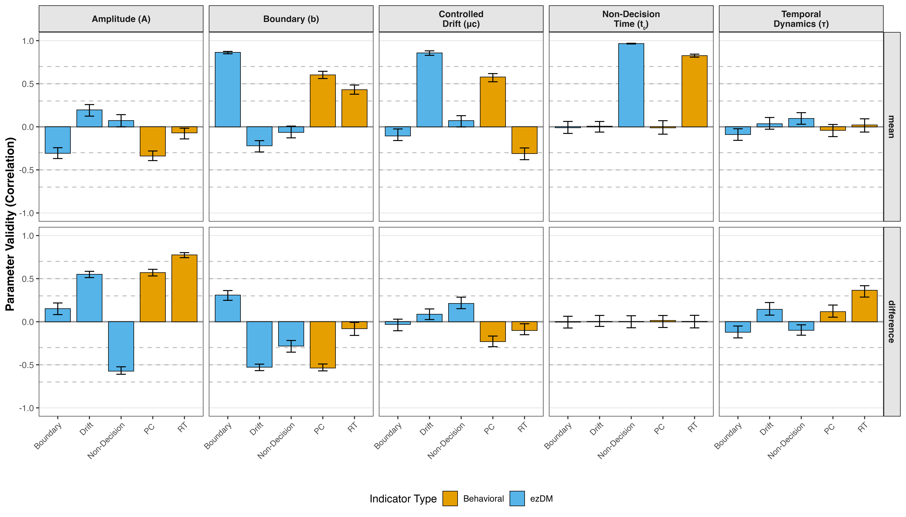

```{r knitr-options, include = FALSE}
knitr::opts_chunk$set(
  eval = TRUE,
  echo = FALSE,
  output = TRUE,
  warning = FALSE,
  error = FALSE,
  message = FALSE,
  collapse = TRUE
)
```

```{r}
# use relative paths to load & save data
pacman::p_load(here, SimDesign, tidytable, data.table, ggplot2, ComputationalValidity)
# source(here("scripts","LoadResultsFiles.R"))
```

## Introduction

The present work is concerned with a problem that cuts across cognitive psychology: psychometric methods alone cannot determine what cognitive tasks actually measure, and decades of methodological refinement have not resolved it. We argue that the problem of validity -- ensuring that the observed variables we obtain from task performance actually measure what we intend to measure -- cannot be solved by refining methods alone. Validity rests on theoretical commitments, and therefore, ensuring validity requires theoretical work. We develop our argument with reference to several example cases, with a primary focus on the measurement of attention control ability.

Across several domains, researchers have tried to establish what cognitive tasks measure by (1) increasing the reliability of behavioral indicators and (2) assessing validity through convergent and discriminant correlations among indicators. These efforts have met with persistent challenges.

In attention control research, conflict tasks that produce robust experimental effects often fail to correlate substantially across individuals -- the so-called reliability paradox [@HedgeEtAl2018; @ReyMermetEtAl2018; @EnkaviEtAl2019]. Some researchers responded by optimizing reliability, sampling diverse conflict tasks, and demonstrating coherent factor structures [@DraheimEtAl2021; @Burgoyne2023]. Others argued that these tasks do not tap the same processes, that the new measures face challenges similar to those of the original ones [@ReyMermet2025], and that attention control factors relate more strongly to processing speed than to working memory capacity [@LoefflerEtAl2024].

A similar pattern characterizes working memory research. Complex span and N-back tasks correlate only moderately despite adequate reliability, a pattern first documented by @KaneEtAl2007 and confirmed meta-analytically by @RedickLindsey2013. The resulting debate spans nearly two decades: some researchers argue that the tasks measure distinct constructs [@KaneEtAl2007; @BurgoyneEtAl2024WM], whereas others maintain that working memory capacity is a unified ability complicated by task-specific demands [@SchmiedekEtAl2009; @WilhelmEtAl2013; @SchmiedekEtAl2014; @WilhelmEtAl2025].

The processing speed literature tells a complementary story. Early attempts to isolate process-specific speed using elementary cognitive tasks such as memory-scanning [@Sternberg1966] or the Hick paradigm [@Hick1952] failed to produce robust correlations with intelligence [@BeauducelBrocke1993]. @Lohman1994 explained why: Most between-person variance is carried by the intercept of regression models, which reflects what is common across conditions, not by slopes or experimental contrasts. Traditional measures of "processing speed" thus conflate perceptual encoding, decision processes, and motor execution.

Across these domains, the same structural limitation recurs. High reliability and well-converging factor models do not guarantee valid measurement of the intended constructs. Here and throughout, we use *behavioral indicators* to refer to summary statistics computed from trial-level behavioral data -- such as mean reaction time, accuracy rates, difference scores, or parameters from simplified computational models -- that researchers use to quantify individual differences. Factor coherence demonstrates shared variance but not what mechanisms produce it. Correlation patterns cannot adjudicate whether weak convergent validity reflects measurement inadequacy or genuine construct distinctiveness. Many researchers treat these difficulties as methodological problems requiring better techniques, larger samples, or more careful task selection. We argue that the core problem is theoretical. Without explicit commitments about how cognitive processes generate observable behavior, validation becomes circular: tasks are validated by their correlations with other tasks assumed to measure the same construct.

We develop this argument by building on @Borsboom2004's causal conception of validity, according to which valid measurement requires the attributes we aim to measure to *causally produce* the measurement outcomes. Computational cognitive models implement this framework: They specify what cognitive processes exist (as model parameters) and how these processes generate observations (through explicit generative mechanisms). To the extent that we established confidence in the adequacy of a cognitive model for a task, we can use it to inform the validity of behavioral indicators from that task as measurements of the processes that the model describes. We can use simulations with the model to test the causal link, that is, whether individual differences in behavioral indicators reflect individual differences in the generating processes.

In the following, we first diagnose why traditional validation approaches cannot resolve what tasks measure, then develop a framework for model-based validity analysis, and finally demonstrate this framework through simulations with cognitive models of conflict tasks that are often used to measure attention control. We conclude with implications for measurement practice and a discussion of the dependence of measurement on theoretical assumptions. Although our demonstrations focus on conflict tasks, the principles apply wherever cognitive processes must be inferred from behavioral observations.

## Classical Validity Theory

Theory has been central to validity frameworks since their inception, but the specific theoretical requirements for cognitive task validation have often remained implicit in practice.

@CronbachMeehl1955 introduced the concept of construct validity for situations where the measured attribute is not directly observable. They argued that validation is fundamentally theory testing: The construct is embedded in a "nomological network" that generates testable predictions about patterns among measures, experimental manipulations, and group differences. Critically, they recognized the risk of circularity: "Unless the network makes contact with observations independent of the test, the investigation is boot-strapping and is not construct validation" (p. 291).

@CampbellFiske1959 operationalized this logic through the multitrait-multimethod (MTMM) matrix, separating trait variance from method variance and establishing convergent and discriminant validity as key criteria.[^1] However, the MTMM framework embeds a critical assumption: That correlation magnitude can adjudicate whether different measures target the same underlying construct. This becomes problematic when the processes reflected in behavioral measures and generating observed correlations are complex or incompletely understood.

[^1]: The logic underlying the MTMM matrix — that consistent covariation among behavioral indicators reveals common source traits more fundamental than surface correlations — originates in @Cattell1943b's factor-analytic approach to personality, where factor analysis of trait ratings identified source traits underlying clusters of covarying surface behaviors [@Cattell1943a]. @Cattell1944 later formalized this reasoning as the principle of "parallel proportional profiles": if the same factor structure replicates across independent samples or data types, this constitutes evidence for a real underlying trait. In practice, comprehensive tests of factorial invariance across observational contexts are rarely conducted, and recent research indicates that within-person covariance structures can differ considerably from between-person structures [@Molenaar2004; @Hamaker2005].

Later refinements in the conception of validity maintained the central role of theory. @Messick1995 argued for a unified conception centered on "score meaning," emphasizing that the substantive component of validity - understanding what processes underlie task performance - is essential to interpretation. @Kane2013 developed an argument-based framework in which researchers must construct explicit arguments for the intended interpretation or use of test scores, and each argument's assumptions can be evaluated empirically; in principle, such arguments could incorporate process models as warrants for construct interpretations. Both frameworks thus recognize the need for theoretical grounding of score meaning [see @MarkusBorsboom2013 for a comprehensive treatment]. However, neither specifies what form such theoretical commitments must take for cognitive constructs -- what level of mechanistic detail is required, or how process-to-indicator mappings should be formalized. This gap is consequential: without explicit guidance on the form of process specification, validation efforts default to correlational evidence, which, as we argue next, introduces circularity.

@Whitely1983 [subsequently Embretson] drew a more fundamental distinction: *construct representation* refers to the theoretical mechanisms that generate task performance, whereas *nomothetic span* refers to the correlational network among measures. She argued that psychology had over-emphasized nomothetic span at the expense of construct representation, focusing on whether tasks correlate rather than on what processes produce performance. As she noted, "internal construct validity — representing the construct — is just as important as external construct validity — relating to other measures" (p. 179). This distinction is especially consequential for cognitive psychology, where process models can specify construct representation with some precision, and it foreshadows our central argument.

This conceptual focus on the construct representation and its causal role with respect to observed behavior was sharpened by @Borsboom2004. They defined validity in explicitly causal terms: "A test is valid for measuring an attribute if and only if (a) the attribute exists and (b) variations in the attribute causally produce variations in the measurement outcomes" (p. 1061). This causal requirement cannot be verified through correlations alone. It demands theoretical specification of the mechanisms linking constructs to observations.

We operationalize Borsboom's framework through computational cognitive models. When we specify constructs as process parameters in generative models, we make explicit claims about (a) what cognitive attributes exist and (b) how variations in those attributes causally produce measurement outcomes. @KvamAlaukik2025 converge on a complementary approach, a connection we discuss in more detail below.

Despite consistently emphasizing theoretical commitments - nomological networks, trait-method distinctions, score meaning, construct representation, causal mechanisms - classical frameworks have left these requirements underspecified especially with respect to practical implications for how to establish validity. Without explicit process theories, validation efforts rely on convergent validity: The expectation that tasks assumed to measure the same construct should correlate. As we show next, this logic becomes circular when the construct itself is defined through task correlations.

## The Circularity Problem in Correlation-Based Validation

The validation logic underlying the research programs described above is often circular: When constructs are defined through task correlations, those correlations cannot also serve as evidence for construct validity. This limitation is structural, not a shortcoming of individual research programs, which typically exemplify current best practices.

Consider @DraheimEtAl2021's effort to improve attention control measurement by adapting conflict tasks with response deadlines while avoiding difference scores [@Draheim2019]. They validated these new tasks against standard psychometric benchmarks: High reliability, strong intercorrelation with other attention control tasks, and substantial correlations with working memory capacity and fluid intelligence. On these criteria, the tasks succeeded, leading the authors to conclude they had achieved improved measurement of attention control. Yet this validation strategy embeds a circular logic. @ReyMermetEtAl2018 and @ReyMermet2025 have argued that attention control ability is probably not a unitary construct. Whether or not the ability to control attention in different situations reflects in part a general ability to control attention is a substantive question, and to resolve it we need valid measures of attention control. Yet, the approach of Draheim and colleagues for validating their new measure presupposes the existence of a general attention-control ability. By selecting tasks based on intercorrelations with other tasks *assumed* to measure attention control, the approach biases the substantive question it aims to answer [@Oberauer2024]. The same circularity characterizes working memory research, where @WilhelmEtAl2013 and @WilhelmEtAl2025 defend capacity as a unified construct against @BurgoyneEtAl2024WM's claim that span and N-back tasks measure distinct abilities -- a debate where both sides rely on correlational patterns to define what the construct is, then use those same patterns as evidence speaking to the validity of working-memory measures.

No amount of psychometric refinement can resolve the interpretive ambiguity this creates. Does factor coherence among conflict tasks demonstrate shared control processes, or merely shared method variance [@LoefflerEtAl2024]? When working memory tasks correlate only moderately, does this reflect distinct constructs or inadequate indicators of a common one? Correlational evidence alone cannot adjudicate, because the validation logic itself is circular.

The circularity becomes apparent when we trace the reasoning explicitly: (1) We theorize that there is a general attention-control ability. To test this assumption we need tasks that validly measure attention control. (2) From the assumption of a general ability we predict that tasks that require attention control to a substantial degree should be positively correlated. (3) We sample several tasks of which we believe that they require attention control, for instance Anti-Saccade and Visual Arrays tasks, and find them to be positively correlated. (4) We conclude that these tasks are valid measures of attention control, and (5) we conclude that their positive correlation confirms the assumption of a general attention-control ability. The reasoning is circular because the validation of the tasks rests on the substantive assumption that we set out to test with these tasks. The same circular reasoning applies to working memory (span-N-back correlations) and processing speed (RT-ability correlations). As @Borsboom2004 noted, this creates "a closed circle of test interpretation where tests are validated by their intercorrelations, and the intercorrelations are explained by appealing to the constructs that were posited to explain those intercorrelations in the first place" (p. 1066). Factor analysis does not break this circle - extracting a latent factor demonstrates shared variance, but the psychological meaning of that factor depends on assumptions about what the tasks measure [@Borsboom2005; @MarkusBorsboom2013]. An "attention control" factor might equally reflect general processing speed; a "working-memory capacity" factor might reflect executive attention rather than storage capacity. Without independent specification of what processes generate the factor, construct labels merely relabel the correlation pattern.

To be sure, some validation strategies partially escape this circle. Experimental dissociations -- showing that manipulations selectively affect one task but not another -- provide non-correlational evidence about process specificity. Neuroimaging studies can test whether tasks assumed to share a process also share neural substrates. Clinical group comparisons assess whether tasks are differentiated by diagnosis in theoretically predicted ways. These approaches strengthen validity arguments beyond pure correlational logic. However, they still rely on (sometimes implicit) theoretical assumptions to interpret which processes are distinguished by an experimental dissociation, which process is reflected in overlapping neural-activity patterns, and which process is affected differently by different clinical conditions. The circularity is attenuated but not eliminated: the interpretive framework remains underspecified whenever the process-to-indicator mapping is not made explicit.

As @Whitely1983 recognized, nomothetic span cannot substitute for construct representation. When tasks fail to correlate as expected - when attention-control factors relate more strongly to speed than to working memory [@LoefflerEtAl2024] - correlation patterns alone cannot adjudicate whether the construct is wrong or the measurement is invalid.

Breaking this circularity requires establishing validity independently for each behavioral indicator before using cross-task correlations as validity evidence. The validity of an indicator must be demonstrated through independent specification of how the target process generates that indicator, not through correlations with other indicators assumed to measure the same construct. Only after validity has been established independently for indicators from different tasks can their inter-correlations meaningfully test whether performance reflects a unitary ability or diversity in supposedly related processes. This sequence reverses current practice: Rather than selecting tasks based on their correlations and then claiming those correlations validate the construct, researchers must first specify what processes each task engages and which indicators reflect those processes, then test whether predicted process-level relationships emerge.

Concretely, independent indicator validation requires a *generative* specification: A model that predicts how individual differences in a target process map onto individual differences in an observable indicator [@KvamAlaukik2025], without presupposing the correlational patterns this prediction aims to explain. Verbal theories can identify candidate processes, but they cannot determine how strongly each process contributes to a given indicator, or whether nuisance processes contaminate the indicator. Quantifying the process-to-indicator mapping requires progressively more formal specification - from verbal frameworks that constrain interpretation, through semi-formal decompositions that test component processes, to generative computational models that simulate complete data from explicit process assumptions. This formalization continuum defines what kinds of validity claims each level of theory can support.

## From Constructs to Processes: A Formalization Continuum

The independent validation required by the preceding argument demands a specific theoretical move: Reconceptualizing cognitive constructs as information-processing mechanisms with specifiable behavioral consequences, rather than as latent factors defined through shared variance. Although this is common in cognitive experimental psychology, in most individual-differences research, cognitive constructs are treated as latent factors - unobserved variables that account for shared variance among indicators. This framing naturally leads to validation through convergent validity, and thus back into the circularity diagnosed above. 

A process-oriented view [@FrischkornEtAl2022] begins from a different starting point: Cognitive constructs are hypotheses about information-processing mechanisms that generate behavior. From this perspective, "attention control" refers not to an ability -- an unspecified source of variance and covariance between individuals -- but to a set of mechanisms and processes by which the cognitive system controls attention, and which vary in their effectiveness and efficiency between individuals. These processes include measuring and resolving conflict, enhancing relevant and suppressing irrelevant information, flexibly adjusting processing strategies, with computational and temporal properties that can be specified with varying degrees of formality [e.g., @BotvinickEtAl2001; @CohenEtAl1990; @HubnerEtAl2010; @LoganGordon2001; for a comprehensive overview, see @ReyMermet2025]. Critically, tasks do not "measure" constructs directly - they create conditions under which processes operate and produce observable outcomes. A flanker task does not measure attention control in the way a thermometer measures temperature. It creates a situation where control processes contribute to determining reaction times and error rates in the different experimental conditions. But as we will see from the simulation results presented later, different  behavioral indicators capture different aspects of the processes that interplay and generate the observed behavior. In sum, how strongly a specific observed performance indicator indexes a specific process depends on the processing architecture [@TownsendAshby1983]: what processes are engaged, how they interact, and how their activity maps onto behavior.

Under this view and following the conception of validity proposed by @Borsboom2004, a behavioral indicator is valid for a cognitive process to the extent that variation in that process causally influences variation in the indicator. This has several implications. Validity is *graded*: an indicator can be more or less valid depending on how strongly the target process influences it. It is *parameter-specific*: Different indicators from the same task may be differentially valid for different model parameters. It is *model-relative*: Validity claims depend on the theoretical assumptions embodied in a cognitive model, a point we return to in the discussion. And it is *testable*: Predictions about the sensitivity with which an indicator tracks a process can be evaluated against data. When processes are formalized in computational models, individual differences in constructs correspond to individual differences in model parameters [@Oberauer2016], such as evidence accumulation rate, response threshold, or conflict resolution efficiency.

The strongest validity assessments come from formal *generative* models that specify processes and their interplay mathematically, making all assumptions explicit [@GuestMartin2021]. With such a model, one can simulate data from known parameter values, compute the same behavioral indicators that empirical researchers use, and test whether those indicators reflect the generating parameters. This approach underlies what has been termed *cognitive psychometrics* - locating individual differences at the level of process parameters rather than behavioral scores [@Vandekerckhove2011; @RouderLu2005; @SchubertFrischkorn2020; @FrischkornEtAl2022]. Because the validation criterion is the known generating parameter values, this approach provides the independent test that traditional correlational validation cannot.

The key point is that validity claims require explicit theoretical commitments about how processes generate behavior [@Borsboom2004]. Without such commitments, validation becomes circular; with them, it becomes testable and falsifiable.

## Validation Through Generative Models

A formal generative model specifies all processes and parameters necessary to simulate behavioral data trial-by-trial. If such a model correctly describes how cognitive processes generate behavior, and if a behavioral indicator reflects a specific process, then individual differences in the indicator should track individual differences in the corresponding model parameter. We can assess this through four steps: 1) specify a generative model formalizing theory about how behavior in a test situation comes about, 2) simulate data with parameter values that vary across simulated participants, 3) compute the same behavioral indicators researchers typically use from those data, and then 4) assess how strongly those indicators correlate with the parameter values that researchers aim to measure. Strong correlations indicate valid measurement of the corresponding process; weak correlations indicate confounding of the behavioral indicator or insensitivity of the indicator for the process of interest.

Because the validation criterion - the generating parameter values - is established independently of between-task correlations, validity claims no longer rest on the circular logic diagnosed above. They remain conditional on model adequacy, but model adequacy can be evaluated independently through model fitting and comparison techniques and through experimental tests.

Validation through generative models can reveal systematic patterns that challenge common measurement assumptions. Different behavioral indicators may validly measure different parameters - a possibility we demonstrate below as differential validity. Indicators may correlate with multiple parameters at once, revealing process impurity invisible to correlational validation. High reliability may coexist with weak validity. These possibilities follow from the computational psychometrics framework [@Vandekerckhove2011; @Vandekerckhove2014], which locates individual differences at the level of process parameters and asks whether indicators capture those parameter-level differences [@Oberauer2016; @FrischkornEtAl2022]. Compared to correlational validation, generative-model based validation offers independence from criterion measures, quantitative precision that allows principled comparison, and the ability to distinguish which processes each indicator captures.

These advantages come with limitations. Generative-model based validation is necessary but not sufficient -- it establishes measurement potential under idealized conditions where the true generating model is known. Real data introduce complexities that simulations may not capture: Strategies varying between and within individuals, learning effects, fatigue, and model misspecification. Strong validity estimates therefore demonstrate that an indicator *can* validly measure a process given the assumed model. Therefore, the simulation results we report below should be understood as existence proofs: They establish what measurement relationships are *possible* under specific models, revealing structural constraints that no amount of empirical data can overcome. The theoretical investment is real but bounded: existing models can be applied without developing new ones, and validity assessment establishes validity once for an indicator-construct pairing, informing subsequent research.

### Simulation Design

We use cognitive conflict tasks (such as flanker, Simon, and Stroop tasks) as an example for illustrating how validity can be established based on formal generative models. From our perspective, these tasks are well suited as a testbed, because their traditional behavioral indicators - RT differences between incongruent and congruent conditions - have recently been criticized as invalid measures of attention control [@Draheim2019; @Yanguez2024]. Yet, they remain widely used in individual-differences research [@DraheimEtAl2021; @FriedmanMiyake2004]. They exhibit the validity challenges documented above, several generative computational models exist for them [@UlrichEtAl2015; @WhiteEtAl2011], and they produce multiple candidate indicators. Conflict resolution involves multiple processes (conflict detection, strategy adjustment, selective weighting of perceptual information, response inhibition), which raises the question of which indicators capture which of these processes.

We focus on two generative models formalizing different perspectives on conflict processing. The Diffusion Model for Conflict [DMC; @UlrichEtAl2015] conceptualizes conflict as arising between automatic and controlled evidence accumulation. *Automatic activation* triggered by salient features (captured in the amplitude *A*, and temporal dynamics tau) and *controlled processing* integrating task-relevant information (represented by the drift rate *mu_c*) combine to drive a diffusion process toward response boundaries (separation *b*), with non-decision time (*non_dec*) for encoding and motor execution. The Shrinking Spotlight model [SSP; @WhiteEtAl2011; @WhiteEtAl2018] takes an attentional focus perspective: attention initially encompasses both relevant and irrelevant features, then gradually narrows onto task-relevant features. Parameters include perceptual input strength (*p*), initial attentional spread (*sd_0*), boundary separation (*b*), and non-decision time (*non_dec*). Using two architecturally distinct models allows us to distinguish validity patterns that are architectural-general --emerging from both models despite different processing assumptions - from those that are model-specific.

We conducted separate simulations of behavior in a conflict task using DMC and SSP, following identical design principles. The task was to make binary decisions on a relevant stimulus dimension (e.g., the feature of the target of a flanker task) in the context of an irrelevant stimulus dimension (e.g., the feature of the flankers). Half of the trials were congruent (i.e., the flanker feature matching the target feature) and the other half were incongruent. We systematically varied sample size (*N* = 25, 50, 100, 200) and trials per condition (50, 100, 200), with each design cell replicated 250 times. For each simulated participant, we drew parameter values from distributions producing realistic behavioral patterns, and generated trial-level RT and accuracy data. From these data we computed standard behavioral indicators: mean scores (average RT and accuracy), condition-specific scores (congruent only, incongruent only), and difference scores (RT or error rate in incongruent minus congruent trials). Because researchers have argued that applying computational measurement models to estimate parameters improves measurement [@Yanguez2024], we also calculated EZ-Diffusion Model parameters [@WagenmakersEtAl2007] - a simplified model that estimates basic diffusion parameters from aggregate behavioral statistics without assuming the DMC's or SSP's specific architecture. With the EZ-diffusion model we test whether measurement models improve validity over raw behavioral indicators. Correlations between indicators and generating parameters serve as quantitative validity estimates; split-half reliability provides an independent assessment of indicator consistency.

For cross-task analyses, we generated data from two independent "tasks" with induced parameter correlations (e.g., controlled drift rate in Task 1 correlated with Task 2), testing whether parameter-level correlations transfer to indicator-level correlations. All simulations were conducted in R; code, datasets, and analysis scripts are available in the ComputationalValidity R package (https://github.com/GidonFrischkorn/ComputationalValidity).

## Model-Based Validity Analysis

The simulations reveal three systematic patterns that challenge common measurement assumptions and demonstrate why explicit process models are necessary for validity assessment. For each phenomenon, we present results from both DMC and SSP to demonstrate that key findings generalize across architecturally distinct models.

### Selective Validity


Figure 1 presents validity correlations between all five DMC parameters (controlled drift $\mu_c$, temporal dynamics $\tau$, automatic activation amplitude *A*, boundary separation *b*, and non-decision time $T_{er}$) and four indicator types (RT difference, accuracy difference, RT mean, accuracy mean). The dominant pattern is *process impurity*: Most behavioral indicators reflect a mixture of multiple cognitive processes. Accuracy difference scores substantially reflect both automatic activation amplitude (*A*: *r* = 0.57) and boundary separation (*b*: *r* = -0.54), conflating control-related processes with response caution. RT mean scores primarily reflect non-decision time ($T_{er}$: *r* = 0.83) but also boundary separation (*b*: *r* = 0.43), conflating perceptual and motor processing with decision caution. Accuracy mean scores strongly reflect both boundary separation (*b*: *r* = 0.60) and controlled drift ($\mu_c$: *r* = 0.58), conflating caution with efficiency of processing relevant information. Interpreting any of these indicators as measuring a single construct oversimplifies the actual causal structure.

Against this backdrop of typical process impurity, RT difference scores are an exception: They show relatively *selective validity*. RT difference strongly reflects automatic activation amplitude (*A*: *r* = 0.78) and moderately reflects the temporal dynamics of automatic processing ($\tau$: *r* = 0.36), while showing minimal influences of other parameters (\|*r*\| $\leq$ 0.10 for $\mu_c$, *b*, and $T_{er}$). Both *A* and $\tau$ represent interference control mechanisms within the DMC framework: *A* reflects the strength of automatic response activation that must be controlled, while $\tau$ reflects the rate at which this activation is suppressed. RT difference thus validly measures interference control while remaining relatively uncontaminated by non-control processes.

Different behavioral indicators are valid measures of different processes: If we want to measure interference control, RT difference scores provide valid measurement; if we want to measure response caution, accuracy mean scores are more appropriate (*b*: *r* = 0.60), with the caveat that these scores may still conflate multiple processes. No single indicator is universally "best". These differential validity patterns persist even with perfect reliability because they reflect the causal structure of how processes generate behavior.


The SSP yields a convergent pattern (Figure 2). RT difference scores strongly reflect initial attentional noise ($sd_0$: *r* = 0.70) -- the SSP's attention-control parameter governing how broadly attention is initially spread across relevant and irrelevant features -- with weaker influences from perceptual input (*p*: *r* = 0.27) and boundary separation (*b*: *r* = 0.21), and no influence of non-decision time ($T_{er}$: *r* = 0.00). As with DMC, process impurity characterizes most other indicators: Accuracy mean scores reflect perceptual input (*p*: *r* = 0.59), boundary separation (*b*: *r* = 0.55), and initial noise ($sd_0$: *r* = -0.43). RT mean scores primarily reflect non-decision time ($T_{er}$: *r* = 0.76) and boundary separation (*b*: *r* = 0.50). Accuracy difference scores strongly reflect $sd_0$ (*r* = 0.72) but also boundary separation (*b*: *r* = -0.39), again conflating attention-control processes with response caution.

The convergence across models highlights a key result: Despite fundamentally different processing assumptions -- temporal conflict dynamics in DMC versus attentional narrowing in SSP -- both models identify RT difference scores as selectively valid for the attention-control parameter (automatic activation *A* in DMC, initial attentional noise $sd_0$ in SSP). This cross-model agreement suggests that the selective validity of RT difference scores for attention control is a robust structural property of conflict tasks, not an artifact of a particular model's assumptions.

### Reliability is Not Sufficient for Validity


Figure 3 shows a dissociation between reliability and validity. Mean RT and accuracy scores show extremely high split-half reliability (*r* $\approx$ .99) but weak validity (\|*r*\| \< .30 for attention-control related parameters), whereas difference scores show moderate to low reliability (*r* $\approx$ .20 - .70) but strong validity for control-related parameters (\|*r*\| \> .35 for *A* and $\tau$ in RT difference) that changes little with higher reliability. This challenges the common practice of treating high reliability as a prerequisite for validity.

The dissociation has a clear mechanistic explanation. Mean scores primarily reflect individual differences in parameters that affect behavior in congruent and incongruent conditions in the same way, whereas the parameters specific for attention-control processes have opposite effects in the two conditions: Strong control of the automatic process reduces interference in incongruent trials but reduces facilitation from the irrelevant stimulus dimension in congruent trials. Difference scores (subtracting congruent from incongruent performance) remove the contribution of processes common to both conditions, preserving variance related to attention-control-specific processes, but they do so at the cost of lower reliability. Optimizing reliability - a standard psychometric goal [@DraheimEtAl2021; @HedgeEtAl2018] - can thus reduce validity when it increases the influence of processes other than the target processes one aims to measure. The appropriate choice between reliable mean scores and noisier difference scores depends on what constructs the researcher aims to measure - an inherently theoretical question that psychometric properties alone cannot answer.


The SSP simulations replicate the reliability-validity dissociation (Figure 4). Difference scores show moderate to low reliability but strong validity for initial attentional noise ($sd_0$), the SSP's attention-control parameter. Mean scores again show near-perfect reliability but primarily reflect non-control parameters. The same mechanistic logic applies: In the SSP, the initial attentional spread ($sd_0$) determines how much irrelevant information influences processing. This effect operates in opposite directions across conditions -- broader attention increases interference in incongruent trials but increases facilitation in congruent trials -- so differencing removes condition-general variance while preserving control-specific variance. That both models produce the same dissociation for the same structural reason strengthens the conclusion that the reliability-validity trade-off is an inherent feature of conflict task measurement, not a model-specific artifact.

### Parameter Estimation with Cognitive Measurement Models: No Universal Solution



Figure 5 compares validity for behavioral indicators versus EZ-Diffusion Model estimates [@WagenmakersEtAl2007]. EZ-DM parameters are valid measures of corresponding parameters of the more complex generative models. For example, EZ-DM boundary tracks the boundary parameter in the DMC well; EZ-DM non-decision time tracks DMC non-decision time, and EZ-DM drift rate reflects the DMC $\mu_c$ parameter. However, for conflict-specific parameters, behavioral indicators are more valid than EZ-DM parameters: RT difference scores show stronger validity for automatic activation amplitude (*A*) than any EZ-DM parameter, despite EZ-DM parameters controlling for speed-accuracy trade offs that were often seen as a limitation for RT-based measures [@Draheim2019]. Parameters specific to DMC - particularly amplitude (*A*) and temporal dynamics ($\tau$) - show weak or negligible correlation with EZ-DM parameters because these processes are not represented in the simpler model.

We conclude that cognitive measurement models do not always improve validity relative to the use of descriptive scores. Measurement models help when they adequately capture relevant processes but fail when the generative model includes processes the measurement model does not represent. The appropriate measurement model depends on the processes to be measured. Using an inadequate model may be worse than using well-chosen behavioral indicators, because the model imposes structure that misrepresents actual processes.


The SSP simulations confirm this pattern (Figure 6). EZ-DM boundary estimates validly reflect SSP boundary separation, and EZ-DM non-decision time tracks SSP non-decision time. However, for the attention-control parameter ($sd_0$), behavioral difference scores (RT difference: *r* $\approx$ 0.70; accuracy difference: *r* $\approx$ 0.72) substantially outperform all EZ-DM parameters, because $sd_0$ represents an attentional narrowing process that the EZ-DM does not model. Similarly, perceptual input (*p*) is only moderately captured by EZ-DM drift rate. The cross-model convergence reinforces the conclusion: Cognitive measurement models improve measurement for processes they represent but cannot substitute for indicators that directly capture processes outside their scope.

### Synthesis

These three analyses demonstrate systematic constraints on behavioral measurement that emerge consistently from both DMC and SSP. Validity is parameter-specific: Different indicators measure different processes, even from the same task. Claiming that a task measures "attention control" requires specifying which aspects of control and demonstrating that chosen indicators capture those mechanisms [@Oberauer2024]. Increasing reliability may reduce validity when it increases the influence of nuisance processes. Cognitive measurement models are suited for measuring those processes that are included in the models but are ill suited for measuring other processes. These constraints cannot be resolved through psychometric refinement alone - they require explicit process theory. Critically, both models converge on the same key conclusion: RT difference scores are selectively valid indicators of attention-control processes, regardless of whether one assumes the DMC's temporal conflict dynamics or the SSP's attentional narrowing mechanism.

## Parameter Overlap and Cross-Task Validity

Even when cognitive processes are perfectly shared across tasks, behavioral indicator correlations will likely underestimate parameter-level correlations - a phenomenon that explains why cross-task convergent validity is typically weak. The differential validity documented above (Figures 1 and 2) suggests why: Different indicators from nominally similar tasks differentially tap different process parameters, attenuating indicator-level correlations even when processes are shared.

![Correlation transfer failure for DMC. Each panel plots generating parameter correlations (x-axis) against observed cross-task indicator correlations (y-axis) for RT difference scores (orange) and accuracy difference scores (blue). Top row: single-parameter correlations (only the named parameter is correlated across tasks; all others remain uncorrelated). Bottom row: multi-parameter correlations (two parameters simultaneously correlated). The dashed identity line marks perfect transfer. Points consistently fall below this line, indicating that even strong parameter-level correlations transfer only partially to indicator-level correlations.](../figures/manuscript/DMC_Correlation_Transfer.png)

Figure 7 presents results from simulations where we generated data from two independent "tasks" (separate applications of the same DMC model), inducing known correlations between corresponding parameters across tasks. For example, we might set controlled drift in Task 1 to correlate *r* = .70 with controlled drift in Task 2, simulating individuals who show consistent controlled processing efficiency across tasks. We then computed cross-task correlations among behavioral indicators and compared them to the generating parameter correlations.

The results reveal attenuation proportional to the amount of variance captured by behavioral indicators in generating parameters. When parameter correlations are *r* = .60 to .80 (representing strong cross-task process consistency), corresponding behavioral indicator correlations range from *r* = .20 to .70, depending on how strongly they reflect variation in the underlying generating parameters. Even when the underlying construct generalizes across tasks at the parameter level — the same process with the same individual differences appears in both tasks — the behavioral indicators show what would typically be interpreted as weak or moderate convergent validity.

This pattern holds across multiple parameter types and indicator types. Single-parameter correlations (e.g., only controlled drift correlated across tasks) transfer weakly, as do multi-parameter correlations (e.g., controlled drift, automatic activation, and temporal dynamics all correlated across tasks). RT indicators show better transfer than accuracy indicators, but all show attenuation relative to the generating parameters. Note that this design represents a best-case scenario: Both tasks share the identical processing architecture, differing only in parameter values. When real tasks engage overlapping but non-identical process architectures --as is likely for flanker versus Simon or Stroop tasks - correlation transfer would be further attenuated, making the patterns documented here conservative estimates of real-world measurement challenges.


The SSP simulations replicate the correlation transfer failure (Figure 8). When initial attentional noise ($sd_0$) is correlated across tasks at *r* = .60 to .80, RT and accuracy indicator correlations are substantially attenuated. The same holds for perceptual input (*p*) correlations and for multi-parameter correlations (simultaneous correlations in *p* and $sd_0$). The cross-model convergence confirms that correlation transfer failure is a general consequence of process impurity -- not a peculiarity of any particular model's architecture.

This attenuation reflects the confluence of several measurement realities documented in the preceding sections. Process impurity means each indicator reflects parameters only partially or even multiple parameters; if different parameters dominate in different tasks or conditions, indicator correlations will be weakened. Selective validity patterns mean different indicators tap different parameter blends; unless indicator choices perfectly align across tasks, correlations will suffer. Measurement error compounds these problems, though even reliability-corrected correlations may show substantial attenuation.

Weak cross-task correlations do not necessarily imply that the construct we aim to measure does not generalize across tasks. They may reflect measurement limitations even when the underlying mechanisms or processes are perfectly shared between tasks. Conversely, high cross-task correlations of indicators might reflect only weak overlap of the processes of interest (e.g., attention-control related parameters) when the indicator is strongly influenced by other processes, which are shared between tasks (e.g., non-decision time). These two patterns - underestimation through transfer failure and overestimation through confounded shared processes - might appear contradictory, but they are complementary consequences of process impurity. The direction of bias depends on the specific parameter-indicator configuration: When the target process contributes weakly to both indicators, transfer failure dominates; when a non-target process contributes strongly to both, spurious correlation inflates convergent validity. The critical point is that behavioral correlations are unreliable guides to parameter-level relationships in either direction. 

This has implications for ongoing debates. For example, the moderate correlation between complex span and N-back tasks [@KaneEtAl2007; @RedickLindsey2013] may reflect correlation transfer failure rather than construct distinctiveness [@BurgoyneEtAl2024WM] -- a possibility we directly demonstrate in the following section using a formal model of complex span performance. More generally, cross-domain construct claims that rest on moderate behavioral correlations are ambiguous under our framework: such correlations could reflect strong parameter overlap with weak indicator validity, or vice versa.

These findings suggest that stable individual differences in cognitive processes should be located at the level of model parameters, not task scores. Rather than defining "attention control" as the common factor among conflict task scores, we might define it through shared individual differences in specific process parameters (e.g., controlled drift rate) estimated from conflict task models. This grounds construct definition in explicit process theory rather than empirical covariance. Hierarchical Bayesian models [@Vandekerckhove2014; @FrischkornEtAl2022] provide the framework for this approach: parameters for each task are modeled as draws from higher-level distributions representing stable individual traits, and whether such trait-level parameters meaningfully explain between-task covariance becomes an empirical question addressable through hierarchical model comparison rather than assumed a priori. When parameters do covary across tasks, we have evidence for construct coherence grounded in process theory. When they do not, we learn that apparently similar tasks engage different mechanisms or that individual differences are context-specific.

## Generalization Beyond Conflict Tasks

The phenomena documented above could be specific to conflict tasks and the evidence-accumulation architecture that DMC and SSP share. Both models generate continuous RT and accuracy data from a drift-diffusion process; both operate on congruent-incongruent condition contrasts. If process impurity, reliability-validity dissociations, and correlation transfer failure are general consequences of multi-process measurement rather than artifacts of this particular setup, they should also emerge in domains with different process architectures and data types. We tested this by applying the same framework to working memory measurement using complex span tasks, where total accuracy is routinely interpreted as "working memory capacity" [@Engle2002; @EngleEtAl1999] and serves as the primary operationalization of this construct in the intelligence literature [@KaneEtAl2001].

We used the memory measurement model [M3; @OberauerLewandowsky2019], which assumes continuous activations underlying multinomial response categories in complex span tasks. M3 decomposes categorical recall responses into three latent processes: context binding (*c*), the ability to maintain item-context associations; item activation (*a*), baseline activation of memoranda; and filtering (*f*), suppression of distractor interference. On each trial, a participant's response falls into one of five categories: correct recall, distractor intrusions from the current or other contexts, memoranda intrusions from other items, or guessing. This differs from DMC and SSP in two ways: the data are categorical rather than continuous, and the process architecture involves memory encoding and retrieval rather than evidence accumulation.


We applied the identical simulation pipeline (250 replications, *N* = 100, 100 trials). Figure 9 presents the validity matrix (Appendix Figures A1-A2 show reliability-validity dissociations and correlation transfer). Process impurity appears again: accuracy reflects all three M3 parameters simultaneously, paralleling how mean RT and mean accuracy conflate multiple processes in conflict tasks. Different intrusion types show selective but partial validity for different parameters, much as RT and accuracy difference scores do for different DMC and SSP parameters. The reliability-validity dissociation replicates as well: accuracy, the most reliable indicator, does not show the strongest validity for all parameters (Appendix Figure A1). Correlation transfer failure follows the same pattern: when M3 parameters are correlated across two complex span tasks at the generating level, behavioral indicator correlations are attenuated (Appendix Figure A2). No simplified measurement model analogous to the EZ-Diffusion Model exists for categorical response data, so we could not assess intermediate modeling; this absence itself points to the fact that different domains pose different measurement challenges, requiring domain-specific process theory.

The same structural phenomena thus emerge from a memory measurement model applied to categorical memory data as from diffusion-based models applied to continuous RT data. These measurement constraints are not specific to conflict tasks, evidence-accumulation models, or any particular data type. They follow from a more basic fact: whenever multiple cognitive processes jointly determine behavioral indicators, process impurity, reliability-validity trade-offs, and correlation attenuation are likely consequences.

## Measurement Implications

Strong construct claims -- asserting that a task measures a specific cognitive process -- require explicit process theory. Without it, correlational patterns cannot establish what processes drive performance. Traditional psychometric practice reasons that if *N* tasks form a coherent factor, the factor reflects what the tasks have in common, and researchers infer the shared process from an informal task analysis. Our framework shows why this informal analysis is insufficient: An indicator may indeed capture the process of interest, but it also captures other processes, and the factor may primarily reflect the latter. For example, @FrischkornOberauer2025 decomposed antisaccade performance into several component processes and demonstrated that inhibition of reflexive saccades -- the process commonly assumed to be measured by the antisaccade task -- accounts for only a small fraction of performance variance, whereas other parameters, such as perceptual speed, account for much more. These other parameters are likely shared across many tasks and could drive factor coherence without the factor actually reflecting "inhibition" as intended.

We therefore recommend that individual-differences claims about specific cognitive mechanisms be grounded in validation through generative models. This means specifying complete process models, assessing validity through simulation, and using hierarchical parameter estimation [@Vandekerckhove2014; @RouderHaaf2019] to define constructs at the parameter level. The investment required is real but bounded: existing models can be applied without developing new ones, and validity assessment establishes validity once for an indicator-construct pairing, informing subsequent research. The key principle is matching the strength of validity claims to the strength of their theoretical justification.

## Model-Relativity and Generalizability

One natural objection to the framework we propose is that validity claims become model-dependent: different models may yield different conclusions about which indicators are valid. From our perspective, this model-relativity is not the same as arbitrariness. All validity claims already depend on theoretical commitments [@Borsboom2004]. Interpreting flanker effects as measuring "conflict resolution" assumes that conflict creates response competition and that other processes affect both conditions equally. Interpreting complex span scores as "working memory capacity" assumes that storage-plus-processing demands specifically tax capacity limits. These interpretations rest on implicit process models. Making models explicit does not create model-dependence; it makes pre-existing commitments visible and testable.

We do not have the choice between validity claims that depend on theoretical assumptions and validity claims that don't; we only have the choice between validity claims that depend on theoretical assumptions that are more or less precisely and explicitly specified. The more they are, the better we can evaluate, revise, and improve them. This observation reflects a fundamental insight from the philosophy of science: all scientific inference is conducted through models, and model-dependence is an epistemic condition of inquiry, not a special liability of formal approaches [@Giere1988; @Suppes1962]. Making theoretical commitments explicit converts untestable assumptions into testable ones [@Navarro2021; @GuestMartin2021], which is what distinguishes scientific model-dependence from arbitrary convention [@vanRooijBaggio2021].

All validity claims are thus conditional: "*Given* theoretical assumptions X, indicator Y validly measures parameter Z with strength W." This conditionality is epistemic honesty, not a weakness. The simulations reported above demonstrate that some validity patterns emerge from both DMC and SSP despite their different processing assumptions -- in particular, RT difference scores validly reflect attention-control parameters under both models. The same structural phenomena also emerge for working memory measurement using the memory measurement model (M3) for complex span tasks, a domain with a different model architecture and data type, suggesting these constraints on behavioral measurement are not model-class specific. Where models converge, findings reflect genuine measurement constraints; where they diverge, the disagreements can be empirically adjudicated through model comparison.

## Conclusion

*Validity in cognitive psychology is fundamentally a theoretical achievement, not a psychometric property.* It cannot be established through reliability coefficients, factor loadings, or convergent validity correlations alone. It requires explicit commitments about what cognitive processes operate and how they generate observable behavior [@Borsboom2004, @KvamAlaukik2025].

The simulations reported here demonstrated this claim concretely. Process impurity, differential validity, reliability-validity dissociations, correlation transfer failures, and intermediate modeling limits all emerged as systematic consequences of a single structural fact: behavioral indicators conflate multiple cognitive processes whose contributions cannot be disentangled without explicit process theory. These phenomena clarify why decades of psychometric refinement have not resolved what cognitive tasks measure - the problem was never primarily psychometric. The computational psychometrics approach addresses this by making theoretical commitments explicit and testable, providing validity criteria independent of task correlations, and generating falsifiable predictions about indicator-process relationships that correlational validation cannot.

Extension to working memory measurement using the memory measurement model (M3) for complex span tasks confirms that the same phenomena generalize beyond conflict tasks and evidence-accumulation models. The structural constraints we documented arise from general features of cognitive processing, not from the specific architecture of any one model or task type. Further extension to decision-making, learning, and other paradigms would test the boundaries of this generality. Integrating model parameters with neural measures could test whether process-level constructs correspond to distinct neural mechanisms integrating the implementation level into these considerations [@Marr1982]. Hierarchical parameter-based constructs could define individual-differences structures at the process level [@Oberauer2016,@FrischkornEtAl2022], grounding construct definition in explicit theory rather than empirical covariance.

These contributions come with important constraints. The framework requires computational modeling expertise that is not yet widespread in individual-differences research, and well-validated generative models exist for only a subset of cognitive domains. Validity assessment through simulation establishes measurement potential under idealized conditions; whether these patterns hold in empirical data depends on model adequacy, which must be evaluated separately for each application. Moreover, our simulations assumed stationary processes and independent trials - real cognitive performance involves learning, fatigue, and strategic shifts that may alter process-indicator relationships. These limitations define the framework's current boundaries, not its ultimate reach: as generative models are developed for new domains and validated against empirical data, the approach becomes progressively more applicable.

@CronbachMeehl1955 recognized seven decades ago that construct validity is fundamentally about theory testing. The intervening decades of psychometric innovation have confirmed their insight from a direction they could not have anticipated: computational cognitive models now provide the explicit process theories that their framework required but their era could not supply. Advancing validity requires not better correlations, but better theories of how cognition generates behavior.



# Appendix: M3 Complex Span Model -- Supplementary Methods and Results {.appendix}

## Model Description

The M3 model [memory measurement model; @OberauerLewandowsky2019] assumes continuous activations underlying multinomial response categories in complex span tasks and is implemented in the `bmm` R package. On each trial, a participant's response falls into one of five mutually exclusive categories: correct recall (*corr*), distractor intrusion from the current context (*distc*), memoranda intrusion from other items (*other*), distractor intrusion from another context (*disto*), or no plausible response / guessing (*npl*). The probability of each response category is determined by three latent parameters: context binding (*c*), the strength of item-context associations; item activation (*a*), baseline activation of memoranda; and filtering (*f*), the ability to suppress distractor interference. Higher values of *c* and *a* increase correct recall probability, while higher *f* reduces distractor intrusions.

## Simulation Design

We applied the identical simulation pipeline used for DMC and SSP. For the recovery simulations, we generated data across 3 sample sizes (*N* = 25, 50, 100) and 3 trial counts (50, 100, 200 trials), with 250 replications per cell. Parameters were drawn from uniform distributions (*c*: [0.5, 3.5]; *a*: [0.5, 3.0]; *f*: [0.1, 0.9]). Five composite behavioral indicators were computed from the response proportions: accuracy (proportion correct), memoranda intrusions (proportion *other*), distractor intrusions (proportion *distc* + *disto*), total intrusions (proportion *other* + *distc* + *disto*), and guessing rate (proportion *npl*). For the correlation transfer simulations, we generated data from two independent complex span tasks (*N* = 200, 250 replications) with known correlations induced between corresponding M3 parameters across tasks, varying which parameters were correlated (single parameters: *c*, *a*, *f*; parameter pairs: *c*-*a*, *c*-*f*, *a*-*f*).

## Figure A1: Reliability-Validity Dissociation

![Reliability-validity dissociation for the M3 complex span model. Each panel shows the relationship between indicator reliability (x-axis) and validity for a specific M3 parameter (y-axis) across simulation replications. As with the conflict task models, high indicator reliability does not guarantee strong validity for all parameters. Accuracy shows high reliability but variable validity across the three M3 parameters, while lower-reliability indicators (e.g., distractor intrusions) can show comparable or stronger validity for specific parameters.](../figures/manuscript/M3_Reliability_Paradox.png)

## Figure A2: Correlation Transfer Failure

![Correlation transfer failure for the M3 complex span model. Each panel plots generating parameter correlations (x-axis) against observed cross-task indicator correlations (y-axis) for different behavioral indicators. The dashed identity line marks perfect transfer. As with DMC and SSP, points consistently fall below the identity line: parameter-level correlations across two complex span tasks transfer only partially to indicator-level correlations, even when the tasks share identical processing architecture.](../figures/manuscript/M3_Correlation_Transfer.png)
